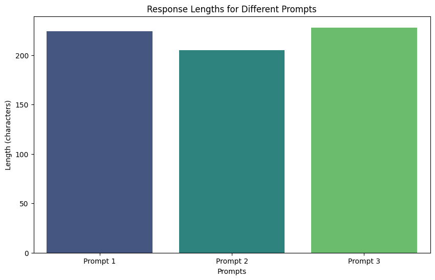

# Language Model Exploration and Analysis

## Project Overview
This project delves into the capabilities of state-of-the-art Language Models (GPT-3, BERT, GPT-2), focusing on implementation, performance evaluation, and research insights. It provides a Jupyter notebook for experimentation, analysis, and visualization.

## Features
- **Model Implementation:** Setup and use models like GPT-3 (via OpenAI API) or Hugging Face's BERT/GPT-2.
- **Text Analysis:** Evaluate contextual understanding, creativity, and domain adaptability.
- **Visualizations:** Generate charts and plots to analyze responses and metrics.
- **Research Questions:** Explore strengths, limitations, and applications of LMs.

## Getting Started
### Prerequisites
- Python 3.7+
- Install required libraries:
  ```bash
  pip install openai transformers torch matplotlib seaborn
  ```

### Running the Notebook
1. Clone the repository:
   ```bash
   git clone https://github.com/your-repo-name.git
   ```
2. Open the Jupyter notebook:
   ```bash
   jupyter notebook
   ```
3. Follow the step-by-step implementation and analysis.

## Project Structure
- **notebook.ipynb:** Jupyter notebook containing model implementation, exploration, and visualization.
- **README.md:** Project documentation.
- **requirements.txt:** Required Python libraries.

## Results and Insights
- Demonstrates LM performance in text generation, summarization, and translation.
- Visualizes model outputs and response metrics.
- Addresses key research questions on LM strengths and limitations.


